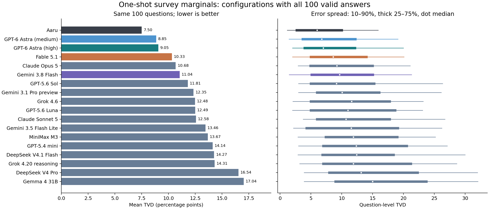
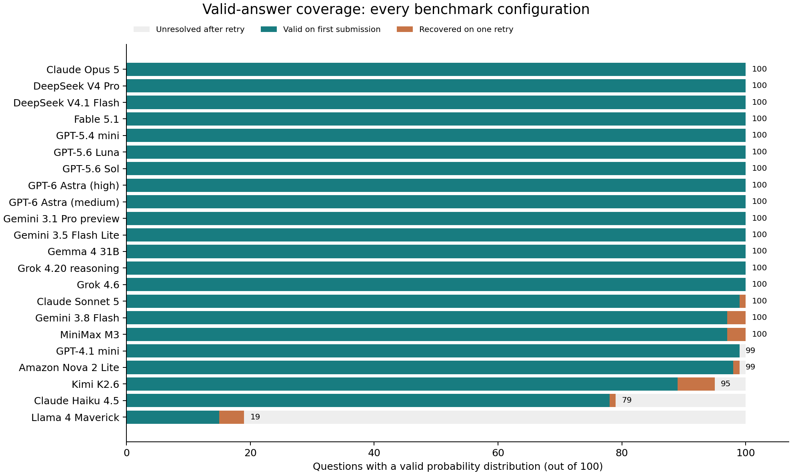
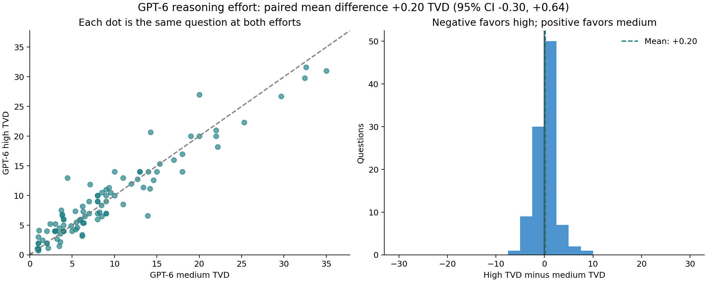
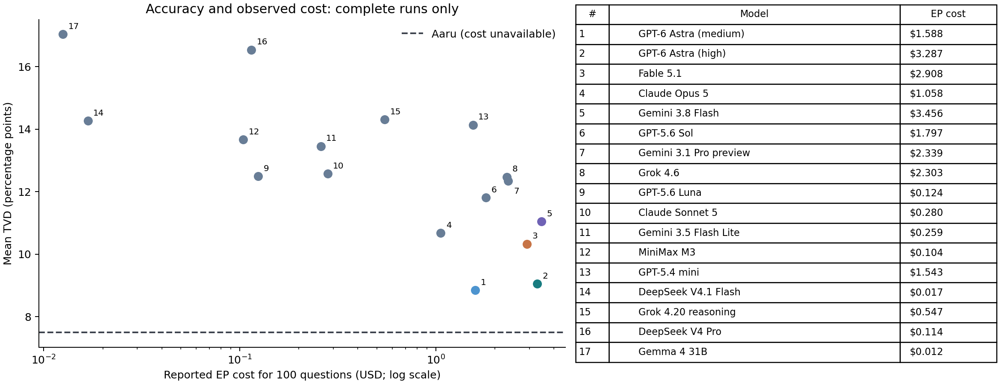
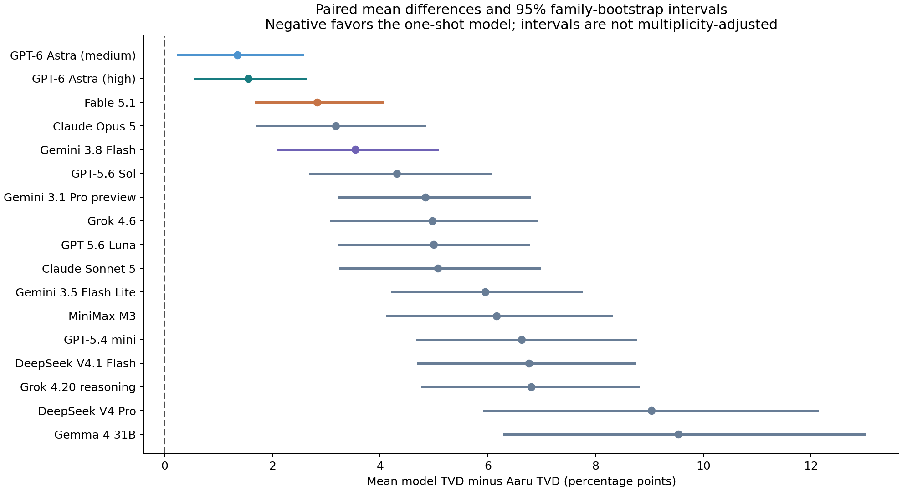
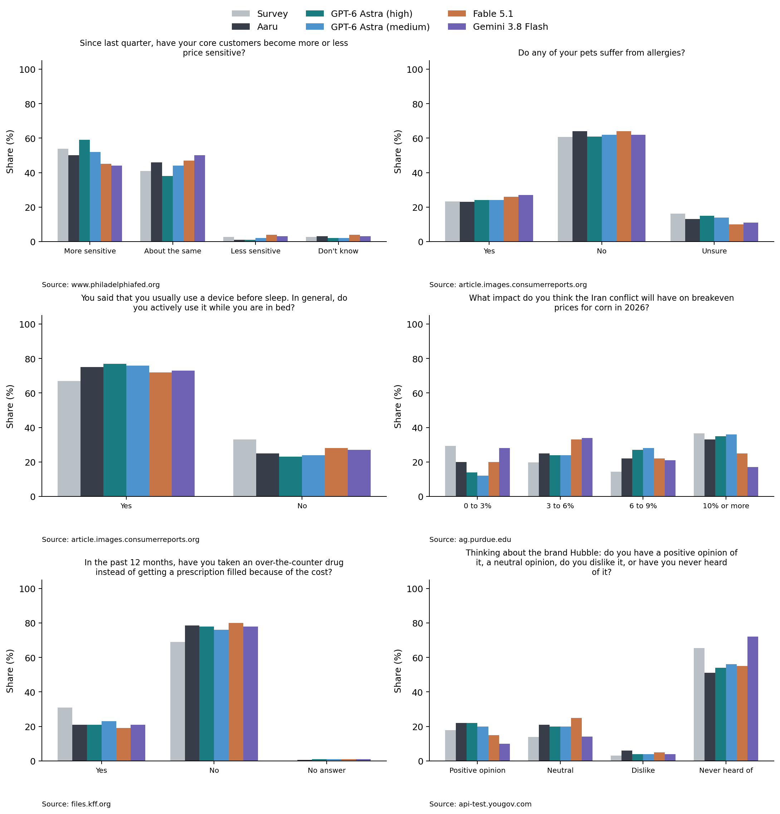

# One-shot survey forecasts with EDSL and Expected Parrot

**21 distinct models, 22 configurations, the same 100 survey questions.** Each model predicts the whole answer distribution in one response through production Expected Parrot. Aaru’s published predictions are scored against the same published survey shares. Lower total variation distance (TVD) is better. The main ranking contains 17 configurations with all 100 valid distributions; 5 incomplete runs are reported separately below.



| Method | Mean TVD ↓ | Difference from Aaru | 95% paired family-bootstrap interval |
|---|---:|---:|---|
| Aaru | 7.50 | +0.00 | — |
| GPT-6 Astra (medium) | 8.85 | +1.35 | [+0.25, +2.57] |
| GPT-6 Astra (high) | 9.05 | +1.55 | [+0.56, +2.62] |
| Fable 5.1 | 10.33 | +2.83 | [+1.69, +4.04] |
| Claude Opus 5 | 10.68 | +3.17 | [+1.73, +4.83] |
| Gemini 3.8 Flash | 11.04 | +3.54 | [+2.09, +5.07] |
| GPT-5.6 Sol | 11.81 | +4.31 | [+2.70, +6.05] |
| Gemini 3.1 Pro preview | 12.35 | +4.84 | [+3.24, +6.77] |
| Grok 4.6 | 12.48 | +4.97 | [+3.09, +6.90] |
| GPT-5.6 Luna | 12.49 | +4.99 | [+3.25, +6.75] |
| Claude Sonnet 5 | 12.58 | +5.07 | [+3.26, +6.97] |
| Gemini 3.5 Flash Lite | 13.46 | +5.95 | [+4.22, +7.74] |
| MiniMax M3 | 13.67 | +6.17 | [+4.13, +8.30] |
| GPT-5.4 mini | 14.14 | +6.63 | [+4.69, +8.74] |
| DeepSeek V4.1 Flash | 14.27 | +6.76 | [+4.71, +8.74] |
| Grok 4.20 reasoning | 14.31 | +6.81 | [+4.78, +8.80] |
| DeepSeek V4 Pro | 16.54 | +9.03 | [+5.93, +12.13] |
| Gemma 4 31B | 17.04 | +9.53 | [+6.30, +12.99] |

**GPT-6 Astra (medium) has the lowest mean one-shot error among complete runs in this sample: 8.85 TVD, versus 7.50 for Aaru.** These are descriptive rankings, with one retained response per question and configuration. The intervals do not adjust for comparing many models or selecting the best result. They do not establish a stable ranking across repeated runs.

## Reproduce without inference

Requires Git and [uv](https://docs.astral.sh/uv/). No credential or model call is needed. The first run downloads locked dependencies.

```sh
git clone https://github.com/expectedparrot/aaru-edsl-benchmark.git
cd aaru-edsl-benchmark
uv run --frozen aaru-edsl reproduce --check
uv run --frozen pytest -q
```

Included: [scores](results/scores.csv), [summary](results/summary.json), [response archive](data/forecasts.json), [cost reconciliation](data/cost_audit.json), [examples and source links](results/examples.json), and [PDF plots](figures/benchmark.pdf). Checksums protect file integrity; they are not independent attestations of inference provenance.

## The EDSL example

```python
import json
from edsl import Agent, Model, QuestionDistribution, Survey
from aaru_edsl.protocol import SYSTEM, MODELS, context

sample = json.load(open("data/sample.json"))
questions = [
    QuestionDistribution(
        question_name=row["question_name"],
        question_text=json.dumps(context(row), ensure_ascii=False),
        question_options=[o["label"] for o in row["options"]],
        include_comment=False,
    )
    for row in sample
]
agent = Agent(traits={"role": "forecaster"}, instruction=SYSTEM,
              traits_presentation_template="")
spec = MODELS["astra"]  # choose any configuration in data/protocol.json
model = Model(spec["model"], service_name=spec["service"], **spec["parameters"])
jobs = Survey(questions).by(agent).by(model)
```

Every model receives identical rendered prompts: population, date, question, instructions, and answer labels. Each interview has empty cross-question memory. Native `QuestionDistribution` validation and an independent archive check require label-keyed probabilities summing to one. No uniform fallback, normalization, retrieval, persona simulation, or fine-tuning is used.

## Run new forecasts through EP — paid

From the repository directory, save an EP key in the local `.env` file by completing the browser login:

```sh
uv run --frozen ep auth login
uv run --frozen ep check
```

With EDSL already installed, the command is simply `ep auth login`. Only an EP key is needed; no direct provider key is used.

```sh
uv run --frozen aaru-edsl infer --stage smoke --allow-paid-inference
uv run --frozen aaru-edsl status
# Repeat status until smoke jobs are saved; inspect failures and cost audits.
uv run --frozen aaru-edsl infer --stage full --allow-paid-inference
uv run --frozen aaru-edsl status
# Repeat status until all jobs are saved.
# If needed, retry only failed questions, once:
uv run --frozen aaru-edsl infer --stage retry --allow-paid-inference
uv run --frozen aaru-edsl status
# Repeat status until retry jobs are saved.
uv run --frozen aaru-edsl archive
uv run --frozen aaru-edsl reproduce
```

Smoke runs ask the first sampled question; full runs ask the other 99. Add `--models astra astra_medium` (or other keys below) to submit a subset. Full submission requires a valid smoke answer for every selected configuration. Existing receipts prevent duplicate submissions; ambiguous submissions block resubmission until reconciled. Raw Results remain under ignored `runs/`. Remote caching is enabled; the single bounded retry bypasses the cache and preserves identical prompts and settings. Successful answers are never rerun based on accuracy. Archiving requires all 100 questions to be accounted for by a valid forecast or a documented final failure after the bounded retry, including retained arms. It replaces the included response archive: use a new branch for a fresh experiment. `--check` verifies the published archive’s numerical results; new stochastic runs need not reproduce those numbers.

## Sample and settings

Selection uses `random.Random(20260927).sample(sorted(eligible, key=id), 100)` from 2,808 eligible categorical questions. Eligibility excludes 143 noncategorical entries and 42 strict duplicates from the 2,993-record export. The seed fixes question selection, not stochastic inference. These 100 questions span 40 operational survey families.

The expansion covers 6 EP inference services and multiple model makers. Service is the hosting route, not necessarily the maker. Models were chosen for provider and size diversity from EP’s text-working catalog with non-fallback prices, then checked for compatibility on one question. This is not an exhaustive or random sample of models. Existing Astra, Fable, and Gemini responses were retained.

| Configuration key | Requested model | EP service | Reasoning setting |
|---|---|---|---|
| `astra` | `gpt-6-astra` | `openai` | high |
| `astra_medium` | `gpt-6-astra` | `openai` | medium |
| `fable` | `claude-fable-5-1` | `anthropic` | high |
| `gemini` | `gemini-3.8-flash` | `google` | dynamic (-1) |
| `sol` | `gpt-5.6-sol` | `openai` | high |
| `luna` | `gpt-5.6-luna` | `openai` | high |
| `gpt54mini` | `gpt-5.4-mini` | `openai` | high |
| `gpt41mini` | `gpt-4.1-mini` | `openai` | provider default |
| `opus` | `claude-opus-5` | `anthropic` | high |
| `sonnet` | `claude-sonnet-5` | `anthropic` | high |
| `haiku` | `claude-haiku-4-5-20251001` | `anthropic` | provider default |
| `geminipro` | `gemini-3.1-pro-preview` | `google` | dynamic (-1) |
| `geminilite` | `gemini-3.5-flash-lite` | `google` | dynamic (-1) |
| `grok46` | `grok-4.6` | `xai` | provider default |
| `grok420` | `grok-4.20-0309-reasoning` | `xai` | provider default |
| `deepseekpro` | `deepseek-ai/DeepSeek-V4-Pro` | `deep_infra` | provider default |
| `deepseekflash` | `deepseek-ai/DeepSeek-V4.1-Flash` | `deep_infra` | provider default |
| `minimax` | `MiniMaxAI/MiniMax-M3` | `deep_infra` | provider default |
| `kimi` | `moonshotai/Kimi-K2.6` | `deep_infra` | provider default |
| `llama` | `meta-llama/Llama-4-Maverick-17B-128E-Instruct-FP8` | `deep_infra` | provider default |
| `nova` | `global.amazon.nova-2-lite-v1:0` | `bedrock` | provider default |
| `gemma` | `google/gemma-4-31B-it` | `deep_infra` | provider default |

All configurations request an 8,192-token output cap; provider enforcement and whether reasoning counts toward the cap can vary. Reasoning controls and temperatures differ across providers: these are not equal compute budgets. Exact parameters and rendered prompts are frozen in [protocol](data/protocol.json) and `data/*_jobs.json` / `data/*_prompts.json`. The [expansion catalog snapshot](data/catalog_expansion.json) records availability and listed prices at selection. EDSL is pinned to public commit `cfef949e4ea87ab0bf6e998ab64b54a1bfcec6e4`.

Reference shares, Aaru forecasts, source URLs, and other survey answers are excluded from prompts. Audience descriptions come from the benchmark and may contain substantive context; excluding numeric targets does not establish freedom from leakage.

## Validity and retries



| Model | Valid on first submission | Final valid |
|---|---:|---:|
| GPT-6 Astra (high) | 100/100 | 100/100 |
| GPT-6 Astra (medium) | 100/100 | 100/100 |
| Fable 5.1 | 100/100 | 100/100 |
| Gemini 3.8 Flash | 97/100 | 100/100 |
| GPT-5.6 Sol | 100/100 | 100/100 |
| GPT-5.6 Luna | 100/100 | 100/100 |
| GPT-5.4 mini | 100/100 | 100/100 |
| GPT-4.1 mini | 99/100 | 99/100 |
| Claude Opus 5 | 100/100 | 100/100 |
| Claude Sonnet 5 | 99/100 | 100/100 |
| Claude Haiku 4.5 | 78/100 | 79/100 |
| Gemini 3.1 Pro preview | 100/100 | 100/100 |
| Gemini 3.5 Flash Lite | 100/100 | 100/100 |
| Grok 4.6 | 100/100 | 100/100 |
| Grok 4.20 reasoning | 100/100 | 100/100 |
| DeepSeek V4 Pro | 100/100 | 100/100 |
| DeepSeek V4.1 Flash | 100/100 | 100/100 |
| MiniMax M3 | 97/100 | 100/100 |
| Kimi K2.6 | 89/100 | 95/100 |
| Llama 4 Maverick | 15/100 | 19/100 |
| Amazon Nova 2 Lite | 98/100 | 99/100 |
| Gemma 4 31B | 100/100 | 100/100 |

Only questions missing a valid distribution receive one explicitly requested retry with unchanged settings. EP may also retry internally. Failed attempts are preserved in [failures](data/failures.json), with [error-type diagnostics](data/failure_diagnostics.json); no invalid answer is repaired into a forecast. Missing answers can reflect validation errors, rate limits, or infrastructure failures. Backend reports do not always include raw failed responses. Kimi’s full job was marked completed but omitted 11 validated distributions; the runner checks every question independently of job status.

Sensitivity check: **11 questions** had valid first-submission answers from every configuration. This small subset is selected by output validity and may differ systematically from other questions. Restricting every method to it gives:

| Method | Mean TVD on common first-submission questions |
|---|---:|
| Aaru | 7.98 |
| GPT-6 Astra (high) | 9.58 |
| GPT-6 Astra (medium) | 8.99 |
| Fable 5.1 | 11.89 |
| Gemini 3.8 Flash | 12.94 |
| GPT-5.6 Sol | 11.92 |
| GPT-5.6 Luna | 11.62 |
| GPT-5.4 mini | 18.18 |
| GPT-4.1 mini | 17.85 |
| Claude Opus 5 | 13.06 |
| Claude Sonnet 5 | 16.49 |
| Claude Haiku 4.5 | 19.22 |
| Gemini 3.1 Pro preview | 14.25 |
| Gemini 3.5 Flash Lite | 17.03 |
| Grok 4.6 | 14.81 |
| Grok 4.20 reasoning | 15.97 |
| DeepSeek V4 Pro | 17.91 |
| DeepSeek V4.1 Flash | 15.49 |
| MiniMax M3 | 15.33 |
| Kimi K2.6 | 17.64 |
| Llama 4 Maverick | 23.54 |
| Amazon Nova 2 Lite | 22.17 |
| Gemma 4 31B | 15.58 |

### Incomplete runs: excluded from the main ranking

Observed-only means use each model’s valid questions and may be biased by selective failure. The bounds instead use all 100 targets, allowing each missing answer any TVD from 0 to 100; they do not impute a forecast.

| Model | Valid / 100 | Observed-only mean TVD | Aaru on same valid questions | Bounds on full-100 mean TVD |
|---|---:|---:|---:|---|
| GPT-4.1 mini | 99 | 16.52 | 7.28 | [16.36, 17.36] |
| Claude Haiku 4.5 | 79 | 18.54 | 8.12 | [14.65, 35.65] |
| Kimi K2.6 | 95 | 14.68 | 7.44 | [13.95, 18.95] |
| Llama 4 Maverick | 19 | 23.16 | 8.42 | [4.40, 85.40] |
| Amazon Nova 2 Lite | 99 | 20.33 | 7.28 | [20.13, 21.13] |

### Smoke screening exclusions

These configurations were not expanded beyond the first question. Decisions used format, infrastructure, and billing checks, without scoring accuracy. One smoke failure does not establish a model’s general inability to answer the task. Smoke answers and cost records are preserved in [screening.json](data/screening.json); settings are in [protocol.json](data/protocol.json).

| Configuration | Reason for withholding the full batch |
|---|---|
| Llama 3.3 70B (`llama33`) | EP reported JobStalledError: the single-question task stayed queued for 602 seconds. No validated answer or full batch; this is an infrastructure failure, not a measured model-format failure. |
| Gemini 2.5 Flash (`gemini25`) | Smoke run produced no native validated distribution; no full batch submitted. |
| Mistral Small 3.2 (`mistral`) | Smoke run produced no native validated distribution; no full batch submitted. |
| Phi-4 (`phi`) | Smoke run produced no native validated distribution; no full batch submitted. |
| Qwen 3.8 Max (`qwen`) | Smoke usage records suggest reasoning tokens included in completion_tokens were charged a second time; full batch withheld pending billing clarification. |
| GLM 5.3 (`glm`) | Smoke usage records suggest reasoning tokens included in completion_tokens were charged a second time; full batch withheld pending billing clarification. |
| MiMo V2.5 Pro (`mimo`) | Smoke usage records suggest reasoning tokens included in completion_tokens were charged a second time; full batch withheld pending billing clarification. |
| Nemotron 3 Ultra (`nemotron`) | Smoke usage records suggest reasoning tokens included in completion_tokens were charged a second time; full batch withheld pending billing clarification. |
| Seed 2.0 Pro (`seed`) | Smoke usage records suggest reasoning tokens included in completion_tokens were charged a second time; full batch withheld pending billing clarification. |
| GPT-OSS 120B (`gptoss`) | Smoke usage records suggest reasoning tokens included in completion_tokens were charged a second time; full batch withheld pending billing clarification. |

## GPT-6: medium versus high

High minus medium mean TVD is **+0.20** (95% paired family-bootstrap interval **[-0.30, +0.64]**). High wins on 37/100 questions, medium on 43/100, with 20 ties. The interval includes zero; this sample does not establish an accuracy advantage for either effort level.

The only configured difference is `reasoning_effort`. Medium was added after inspecting high/Fable/Gemini results; retained responses were collected at different times. This is an exploratory paired comparison, not a randomized repeated experiment.



The separate 2,808-question medium-effort analysis used different prompts and reported GPT-6 TVD 10.11 versus Aaru 7.71. Those full-corpus numbers are not the results of this 100-question experiment.

## Costs and reconciliation



| Model | Results cost | Reported EP job cost | Reconciliation |
|---|---:|---:|---|
| GPT-6 Astra (high) | $3.28681 | $3.28670 | matched |
| GPT-6 Astra (medium) | $1.58811 | $1.58810 | matched |
| Fable 5.1 | $2.90797 | $2.90770 | matched |
| Gemini 3.8 Flash | $3.45663 | $3.45630 | unresolved |
| GPT-5.6 Sol | $1.79696 | $1.79670 | matched |
| GPT-5.6 Luna | $0.12429 | $0.12410 | matched |
| GPT-5.4 mini | $1.54327 | $1.54310 | matched |
| GPT-4.1 mini | $0.03580 | $0.03560 | unresolved |
| Claude Opus 5 | $1.05779 | $1.05760 | matched |
| Claude Sonnet 5 | $0.28054 | $0.28030 | unresolved |
| Claude Haiku 4.5 | $0.08744 | $0.08710 | unresolved |
| Gemini 3.1 Pro preview | $2.33910 | $2.33890 | matched |
| Gemini 3.5 Flash Lite | $0.25916 | $0.25890 | matched |
| Grok 4.6 | $2.30350 | $2.30320 | matched |
| Grok 4.20 reasoning | $0.54706 | $0.54690 | matched |
| DeepSeek V4 Pro | $0.11457 | $0.11430 | matched |
| DeepSeek V4.1 Flash | $0.01738 | $0.01680 | discrepancy |
| MiniMax M3 | $0.10430 | $0.10410 | unresolved |
| Kimi K2.6 | $1.06511 | $1.16280 | unresolved |
| Llama 4 Maverick | $0.00408 | $0.00370 | unresolved |
| Amazon Nova 2 Lite | $0.03627 | $0.03590 | unresolved |
| Gemma 4 31B | $0.01266 | $0.01250 | matched |

Smoke-only excluded configurations add **$0.14990** in reported EP charges.

Total retained-run accounting: **$22.97** in Results and **$23.06** reported by EP. These are observed costs, not fixed prices for future runs.

Results costs use recorded token-price metadata and exclude cache hits. Reported EP costs are job-accounting records, not independently verified account debits. `CostReconciliationWarning` flags differences exceeding $0.0002 per job, allowing two billing line items to round to $0.0001. Answers are saved before warning; a billing discrepancy never triggers a paid retry. See [EDSL #2668](https://github.com/expectedparrot/edsl/issues/2668). A separate [token-accounting check](data/token_accounting_concerns.json) flags cases where inclusive completion counts appear to be charged again as reasoning tokens. Results/EP agreement alone cannot detect that shared error. These flags are evidence for investigation, not independently verified account overcharges; provider estimates may also use different prices or discounts.

A separate Astra `openai_v2` adapter diagnostic returned $0.04981 in Results versus $0.61990 reported by EP. It is excluded from the accuracy comparison and cost table; [its record](data/adapter_diagnostic.json) is preserved. Add that charge when totaling all experiment spending. We chose the catalog-listed `openai` route on billing compatibility before full inference.

## Interpretation

TVD is `50 * sum(abs(predicted_share - survey_share))` for shares on a 0–1 scale, expressed in percentage points. Ten TVD points means ten percentage points of probability mass must move to match the reference. It is not a classification error rate. Questions have equal weight; reference and Aaru shares are scored as exported.

Intervals use 20,000 paired bootstrap draws over survey families (seed 20260927). Connected families share cluster, series, canonical source, or sufficiently long identical question/option text, with a documented Conference Board series join. This operational grouping is not proof of independence. Intervals exclude stochastic reruns, model selection, multiple-comparison adjustment, and human-survey sampling error.



This retrospective benchmark uses published surveys that may occur in model training data. It does not establish prospective performance on novel questions, individual-agent validity, joint distributions, or how Aaru generated its predictions. Results apply to this seeded sample.



Examples show Astra medium/high, Fable, and Gemini 3.8 Flash for legibility. They are the first six sampled questions with at most four options and ASCII wording, selected without reference to errors. All model forecasts and original source links are in the archive.

## Data and provenance

Source: [Aaru’s publication](https://aaru.com/publications/population-simulation-at-the-replication-floor-research) and [question export](https://aaru.com/data/population-simulation/questions.json). A byte-preserving source snapshot and provenance are included. [NOTICE.md](NOTICE.md) describes third-party materials. MIT covers original code only.

GitHub Actions runs tests and offline reproduction without credentials. Public response records contain answers, usage, price metadata, cache flags, and prompts; they omit provider/account identifiers and reasoning content. EP job UUIDs identify supporting private accounting records.
